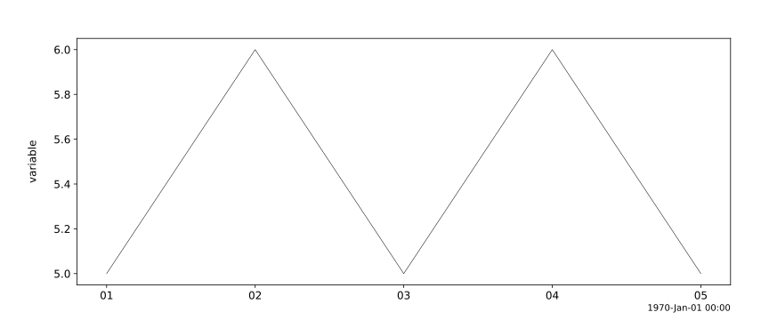

# mutiny

mutiny is a Python library designed for visualizing and analyzing time series data. With an intuitive interface and a focus on flexibility, mutiny empowers users to create high-quality plots that bring time-dependent data to life.

## Usage

| Function | Usage |
| --- | --- | 
| mutiny.store| Create a variable |
| mutiny.get | Get the data from a variable |
| mutiny.plot | Plot variable(s) |

## Examples

```python
from mutiny import store, plot

# Create a variable:
store("variable", data={"x": [1, 2, 3, 4, 5], "y": [5, 6, 5, 6, 5]})

# Plot the variable:
plot("variable", save_svg="simple")
```



## Origin

mutiny is a hard-fork of the `matplotlib` version of `pyplot`, a Python library for plotting and analyzing data in space physics. The space physics code has been removed, and the primary emphasis of this project is to make creating powerful time series plots simple, in a variety of domains (physics, finance, analytics, and everywhere else time series plots are used).

## License

Released under the same MIT license as PyTplot.

